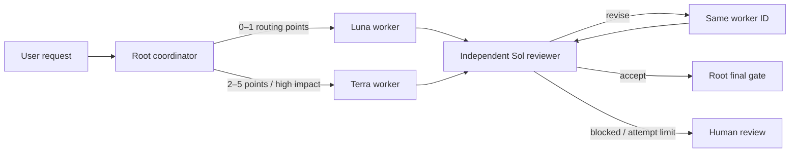

# Codex Model Router Optimization

[](https://github.com/jeffjhunter/codex-model-router-optimization/actions/workflows/ci.yml)
[](https://github.com/jeffjhunter/codex-model-router-optimization/releases)
[](LICENSE)
[](https://www.python.org/)

Cost-aware Sol → Luna/Terra → Sol model routing for Codex.

Codex Model Router Optimization (CMRO) is a repo-scoped Codex skill and custom-agent profile. Sol defines success and owns the final gate, Luna handles clear repeatable work, Terra handles everyday multi-file and tool-heavy work, and a separate read-only Sol reviews the evidence. Failed criteria return to the retained Luna/Terra writer for at most three attempts. It is **not** an API gateway, network proxy, deterministic scheduler, or official OpenAI project.

> [!IMPORTANT]
> This is an independent community project. It is not affiliated with or endorsed by OpenAI or Matt Farmer. Native skill instructions guide agent behavior but do not create a guaranteed state machine or hard security boundary.

## Why this exists

Large coding tasks fail in predictable ways: the plan stays vague, the implementer judges its own work, multiple writers collide, or confidence gets reported as proof. CMRO turns those failure modes into an explicit operating protocol:

- requirement IDs and atomic acceptance criteria before delegation;
- one writer selected by impact and verifiability;
- a separate reviewer checking the real artifact;
- same-worker revision to preserve task context;
- three total worker attempts, followed by human escalation;
- a root-thread final gate before completion.



## Routes

| Route | Default model | Effort | Use it for |
| --- | --- | --- | --- |
| `root` | `gpt-5.6-sol` | xhigh | Contract, route selection, model-identity gate, final decision |
| `luna_worker` | `gpt-5.6-luna` | medium | Clear, repeatable transformations with deterministic checks |
| `terra_worker` | `gpt-5.6-terra` | high | Multi-file work, tools, ambiguity, recovery, and high-impact implementation |
| `sol_reviewer` | `gpt-5.6-sol` | xhigh | Independent evidence review; adversarial checks when risk requires them |

Model access varies by account and rollout. Confirm these IDs in your Codex model picker before a serious run. CMRO pins the project root to Sol so the coordinator identity is automatic; that also changes ordinary Codex prompts in the target repository. Use the documented opt-in variation if that project-wide effect is undesirable.

## Five-minute start

Prerequisites: Python 3.11+, Git, a backed-up or committed target repository, and a current Codex client with custom-agent support.

```bash
git clone https://github.com/jeffjhunter/codex-model-router-optimization.git
cd codex-model-router-optimization

python routerctl.py doctor --target /path/to/your/repository
python routerctl.py install --target /path/to/your/repository --dry-run
python routerctl.py install --target /path/to/your/repository
python routerctl.py verify --target /path/to/your/repository
```

On Windows, quote paths containing spaces:

```powershell
python .\routerctl.py install --target "C:\path\to\your repository" --dry-run
```

Exit code `0` means the requested operation completed. Exit code `2` means a safe manual step remains—usually merging the staged `.codex/config.codex-model-router.example.toml` into an existing config. Exit code `3` means a conflict stopped installation before managed files were overwritten.

Start a new Codex task in the target repository and invoke the workflow explicitly:

```text
$route-codex-work Add a tested CSV export to the activity page. Preserve existing API behavior, keep changes local to this repository, and show the verification evidence.
```

The skill is explicit-only by design. Ordinary Codex tasks do not automatically enter the routed loop.

## Safe operations

```bash
# Machine-readable verification
python routerctl.py verify --target /path/to/repo --json

# Inspect the exact allowlisted payload and hashes
python routerctl.py manifest

# Preview removal, then remove only unchanged installer-owned files
python routerctl.py uninstall --target /path/to/repo --dry-run
python routerctl.py uninstall --target /path/to/repo
```

The installer rejects unexpected payload files, verifies SHA-256 hashes, refuses symlink/reparse-point destinations, avoids overwriting changed managed files, respects root `AGENTS.override.md` precedence, stages incompatible TOML for manual merge, and records ownership for conservative uninstall behavior. Files edited after installation are preserved rather than deleted.

## What is and is not verified

The test suite verifies exact Sol/Luna/Terra model pins, payload integrity, TOML parsing, installation conflicts, Git-root checks, idempotence, config staging, `AGENTS.md` merging, tamper detection, uninstall ownership, paths with spaces, and portable release archives across Windows, macOS, and Linux.

It does not prove that a native Codex run used the configured model, followed every transition, has model entitlement for your account, or preserved a reviewer sandbox against parent runtime overrides. A verified pilot additionally needs independent client/session evidence of Sol → Luna/Terra → Sol. See [limitations](docs/limitations.md) and the [security model](docs/security-model.md).

## Documentation

- [Getting started](docs/getting-started.md)
- [Architecture and lifecycle](docs/architecture.md)
- [Routing policy](docs/routing-policy.md)
- [Configuration and model customization](docs/configuration.md)
- [Security and trust boundaries](docs/security-model.md)
- [Evaluation framework](docs/evaluation.md)
- [Troubleshooting](docs/troubleshooting.md)
- [Design rationale](docs/design-rationale.md)
- [Examples](examples/prompts.md)

## Credits

The Sol → Luna/Terra → Sol pattern was inspired by Matt Farmer’s article, [“Codex Model Routing: Build a Sol–Terra Review Loop”](https://mattfarmer.ai/codex-model-routing). This repository is an independently written implementation with its own installer, verifier, contracts, and safety design. Read [CREDITS.md](CREDITS.md) for the full attribution.

## Contributing

Bug reports, routing scenarios, documentation improvements, and reproducible evaluation results are welcome. Start with [CONTRIBUTING.md](CONTRIBUTING.md), the [support policy](SUPPORT.md), and the [code of conduct](CODE_OF_CONDUCT.md).

Released under the [MIT License](LICENSE).
