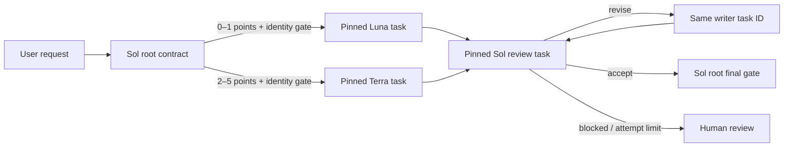

# Codex Model Router Optimization

[](https://github.com/jeffjhunter/codex-model-router-optimization/actions/workflows/ci.yml)
[](https://github.com/jeffjhunter/codex-model-router-optimization/releases)
[](LICENSE)
[](https://www.python.org/)

Cost-aware Sol → Luna/Terra → Sol model routing for Codex, guarded by runtime-evidence gates.

Codex Model Router Optimization (CMRO) is a repo-scoped Codex skill with two fail-closed orchestration backends. In the Codex app, it creates explicitly model-pinned tasks in the same saved local project. On native clients, it can use custom agents only when the surface supports explicit profile selection, staged no-write preflight, completed-turn reads, retained-agent follow-up, and session observation. Sol defines success and owns the final gate, Luna handles clear repeatable work, Terra handles everyday multi-file and tool-heavy work, and a separate Sol task reviews the evidence. Failed criteria return to the retained Luna/Terra writer for at most three attempts.

> [!IMPORTANT]
> CMRO is an independent community project. It is not affiliated with or endorsed by OpenAI or Matt Farmer. It is not an API gateway, network proxy, deterministic scheduler, or hard security boundary.

## Why this exists

Large coding tasks fail in predictable ways: the plan stays vague, the implementer judges its own work, multiple writers collide, or a renamed generic task gets marketed as a different model. CMRO makes those failure modes explicit:

- requirement IDs and atomic acceptance criteria before delegation;
- one model-pinned writer selected by impact and verifiability;
- a no-write identity preflight before implementation;
- strict worker/reviewer packet validation against root-owned context before handoff;
- a separate model-pinned Sol reviewer checking the real artifact;
- same-writer revision to preserve task context;
- one separately accounted, no-write format repair when an action response is useful but malformed;
- three total worker attempts, followed by human escalation; and
- a root-task final gate before completion.



## Routes

| Route | Default model | Effort | Use it for |
| --- | --- | --- | --- |
| `root` | `gpt-5.6-sol` | xhigh | Contract, backend selection, model-identity gate, final decision |
| `luna_worker` | `gpt-5.6-luna` | medium | Clear, repeatable transformations with deterministic checks |
| `terra_worker` | `gpt-5.6-terra` | high | Multi-file work, tools, ambiguity, recovery, and high-impact implementation |
| `sol_reviewer` | `gpt-5.6-sol` | xhigh | Independent evidence review; adversarial checks when risk requires them |

Model access varies by account and rollout. Confirm these IDs in your Codex model picker before a serious run. CMRO pins the project root to Sol, which also changes ordinary Codex prompts in the target repository.

## Proof, not labels

The preferred app backend creates each worker and reviewer with an explicit `model` and reasoning pin. The first turn is read-only. The root checks local session `turn_context` metadata with a bundled privacy-minimized probe before it sends implementation or review work, then verifies every completed implementation, revision, review, and rereview turn before accepting its packet.

A native route is accepted only when its surface exposes explicit custom-agent/profile/type selection, a no-write first turn, status/read with exact completed turn IDs, same-agent follow-up, and session observation. `task_name="terra_worker"`, a task title, a prompt claim, or a TOML filename is never treated as model selection or runtime proof.

## Five-minute start

Prerequisites: Python 3.11+, Git, a backed-up or committed target repository, and a current Codex app with the target repository added as its own saved project. The fallback native backend additionally requires the complete staged contract described above; a profile selector alone is insufficient. For a stable installation, clone the versioned release tag instead of mutable `main`:

```bash
git clone --branch v3.0.1 --depth 1 https://github.com/jeffjhunter/codex-model-router-optimization.git
cd codex-model-router-optimization

python routerctl.py doctor --target /path/to/your/repository
python routerctl.py install --target /path/to/your/repository --dry-run
python routerctl.py install --target /path/to/your/repository
python routerctl.py verify --target /path/to/your/repository
```

On Windows, quote paths containing spaces:

```powershell
python .\routerctl.py install --target "C:\path\to\your repository" --dry-run
```

Exit code `0` means the requested operation completed. Exit code `2` means a safe manual step remains—usually merging the staged `.codex/config.codex-model-router.example.toml` into an existing config. Exit code `3` means a conflict stopped installation before managed files were overwritten.

Start a fresh Codex task in the saved target project and invoke the workflow explicitly:

```text
$route-codex-work Add a tested CSV export to the activity page. Preserve existing API behavior, keep changes local to this repository, and show the verification evidence.
```

The skill is explicit-only. Ordinary Codex tasks do not enter the routed loop. A routed app run creates a no-write worker preflight, continues that same model-pinned task after its identity passes, and later creates a separate model-pinned Sol reviewer task. Those user-owned tasks appear in the Codex sidebar.

## Safe operations

```bash
# Machine-readable installation verification
python routerctl.py verify --target /path/to/repo --json

# Inspect the exact allowlisted payload and hashes
python routerctl.py manifest

# Validate a sanitized final protocol-v3 record
python routerctl.py validate-run --record cmro-final.json

# Validate a worker/reviewer packet against authoritative context
python routerctl.py validate-packet --packet worker.json --context context.json

# Preview removal, then remove only unchanged installer-owned files
python routerctl.py uninstall --target /path/to/repo --dry-run
python routerctl.py uninstall --target /path/to/repo
```

The installer rejects unexpected payload files, verifies SHA-256 hashes, refuses symlink/reparse-point destinations, avoids overwriting changed managed files, respects root `AGENTS.override.md` precedence, stages incompatible TOML for manual merge, and records ownership for conservative uninstall behavior. Files edited after installation are preserved rather than deleted.

## Observed Fieldstead pilot

On 2026-07-14, CMRO was dogfooded on **Fieldstead**, a dependency-free off-grid container-home planning app. In one saved Codex project, the run pinned a Sol coordinator, a Terra writer, and a separate Sol reviewer, then reused the same Terra task for two revision cycles. Exact completed turns were checked against local runtime metadata, and every review used matching before/after content snapshots.

The router did not manufacture a success. After three implementation attempts, the reviewer still found two real defects involving unreadable browser storage and deferred focus restoration, so the bounded run ended `needs_human_review`. A subsequent outer hardening pass fixed both issues, added recovery/focus regressions, and finished with 21 passing deterministic tests plus browser QA. The pilot also exposed a CMRO protocol gap: a useful worker response needed a format-only normalization turn, but v3.0.0 could count that turn as implementation. v3.0.1 adds strict packet validation and explicit repair-turn accounting for that failure mode.

This is one dated, locally observed run with saved metadata and matching snapshots. It is not a cryptographic attestation, a comparative model benchmark, or a guarantee that routing produces correct software. See the [full Fieldstead case study](docs/case-studies/fieldstead-pilot.md).

## What is and is not verified

The automated suite verifies exact Sol/Luna/Terra pins, the privacy-minimized session probe, reviewer-time content snapshots, final-record invariants, payload integrity, TOML parsing, installation conflicts, Git-root checks, idempotence, config staging, `AGENTS.md` merging, tamper detection, uninstall ownership, paths with spaces, and portable release archives across Windows, macOS, and Linux.

Static tests do not prove that a live Codex run used the configured model, followed every transition, has model entitlement for your account, or preserved a reviewer sandbox. The live workflow therefore starts each routed task with a no-write preflight and requires independent session evidence of Sol → Luna/Terra → Sol. A label-only native spawn fails closed. See [limitations](docs/limitations.md) and the [security model](docs/security-model.md).

## Documentation

- [Documentation index](docs/index.md)
- [Getting started](docs/getting-started.md)
- [Architecture and lifecycle](docs/architecture.md)
- [Routing policy](docs/routing-policy.md)
- [Configuration and model customization](docs/configuration.md)
- [Security and trust boundaries](docs/security-model.md)
- [Evaluation framework](docs/evaluation.md)
- [Observed Fieldstead pilot](docs/case-studies/fieldstead-pilot.md)
- [Troubleshooting](docs/troubleshooting.md)
- [Design rationale](docs/design-rationale.md)
- [Examples](examples/prompts.md)

## Credits

The Sol → Luna/Terra → Sol pattern was inspired by Matt Farmer’s article, [“Codex Model Routing: Build a Sol–Terra Review Loop”](https://mattfarmer.ai/codex-model-routing). This repository is an independently written implementation with its own installer, verifier, contracts, and safety design. Read [CREDITS.md](CREDITS.md) for the full attribution.

## Contributing

Bug reports, routing scenarios, documentation improvements, and reproducible evaluation results are welcome. Start with [CONTRIBUTING.md](CONTRIBUTING.md), the [support policy](SUPPORT.md), and the [code of conduct](CODE_OF_CONDUCT.md).

Released under the [MIT License](LICENSE).
