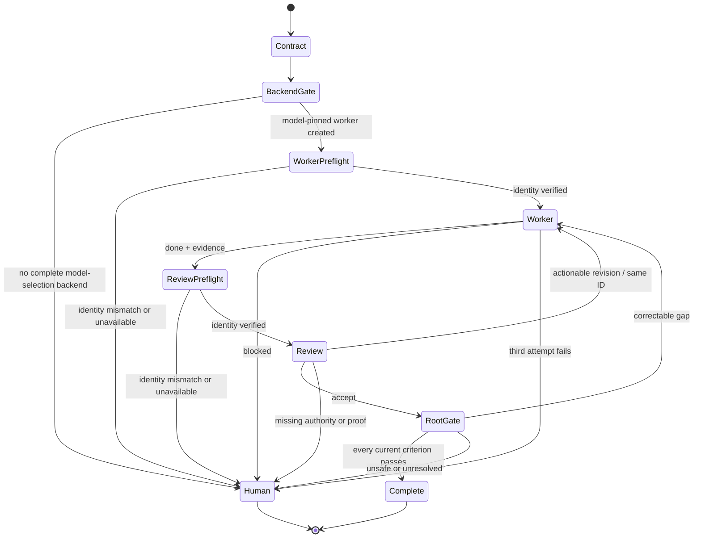

# Architecture

CMRO has a deterministic distribution layer and an evidence-gated Codex orchestration layer.

## Distribution layer

`routerctl.py` manages an exact payload under `router/`.

1. `MANIFEST.json` allowlists every payload file and records its SHA-256 hash.
2. `install` validates the source, target Git root, path components, conflicts, config, and marked instructions before staging writes.
3. Writes are committed as a batch with backups and rollback on failure.
4. An installation record tracks which files were created rather than merely found.
5. `verify` checks current hashes and structural activation.
6. `uninstall` removes only unchanged, installer-owned content.

This layer is deterministic and locally testable. It does not execute Codex or claim that the agent workflow ran.

## Codex layer

The installed profile contains:

- `.codex/config.toml` for the Sol root pin and bounded native-agent settings;
- `.codex/agents/*.toml` for reusable Luna, Terra, and Sol reviewer behavior contracts;
- `.agents/skills/route-codex-work/` for lifecycle, backend selection, packet protocol, runtime observation, and reviewer-time content snapshots;
- `AGENTS.md` for durable, explicit-only repository guardrails.

OpenAI documents [custom agents and subagent controls](https://developers.openai.com/codex/subagents), [skills](https://developers.openai.com/codex/skills), [`AGENTS.md`](https://developers.openai.com/codex/guides/agents-md), and the [configuration reference](https://developers.openai.com/codex/config-reference). These primitives support the actors and instructions; they do not promise application-level transition enforcement.

## Orchestration backends

### Model-pinned Codex app tasks

This is the preferred control-plane backend. A standalone Terra/high identity preflight has been locally observed; a complete Sol → Terra → Sol application run remains the release gate before any end-to-end claim.

1. Resolve the saved local project whose canonical path exactly matches the root task's repository.
2. Create one worker task with an explicit Luna or Terra model and effort pin. Its first turn is read-only.
3. Use `scripts/observe_session.py` from the root to verify the task ID, exact completed turn, selected model, effort, and repository CWD from local session metadata.
4. Continue the retained task with the implementation packet and later revision packets; observe every exact completed action turn before accepting its report.
5. After the writer is idle, create a separate Sol/xhigh task, authenticate it the same way, snapshot repository content, continue it with the read-only review packet, observe the exact review turn, and require an identical post-review content snapshot.

The worker and reviewer are user-owned tasks visible in the Codex sidebar. They share the same local checkout, so CMRO serializes all writes and starts review only after the writer is idle.

### Native custom agents

This backend is conditional. CMRO uses it only when the native surface exposes an explicit custom-agent, profile, or agent-type selector plus no-write first turns, status/read with exact completed turn IDs, same-agent follow-up, and independent session observation. A `task_name` or thread label is not a selector. If any staged capability is absent, CMRO stops before edits rather than pretending the named task loaded a model-specific TOML profile.

The project-scoped agent TOML files remain useful behavior contracts for app tasks and selectable profiles for clients that expose genuine custom-agent selection.

## Lifecycle

## State ownership

The root task owns the stable run ID, plan version, requirement mappings, baseline, allowed paths, backend, retained task IDs, model observations, attempt count, and terminal status. That state stays in root context unless the user explicitly requests an audit artifact.

## Shared-checkout discipline

Exactly one task is write-capable for a run. Root orchestration and review remain read-only while that writer is active. The reviewer starts only after the writer is idle. Root-owned snapshots hash the index and raw contents of tracked and non-ignored untracked artifacts immediately before and after review; unequal digests invalidate acceptance even if `git status` text is unchanged. Separate worktrees are not created independently for worker and reviewer because they would not share the same artifact.

## Versioned packets

Handoffs use `cmro.plan.v3`, `cmro.preflight.v3`, `cmro.worker.v3`, `cmro.review.v3`, and `cmro.final.v3`. Protocol v3 records the backend, actor-contract hash, control-plane pins, every material task-and-turn observation, retained IDs, and root-owned review snapshot evidence. These remain conventions checked by agents, not a code-enforced state machine.
