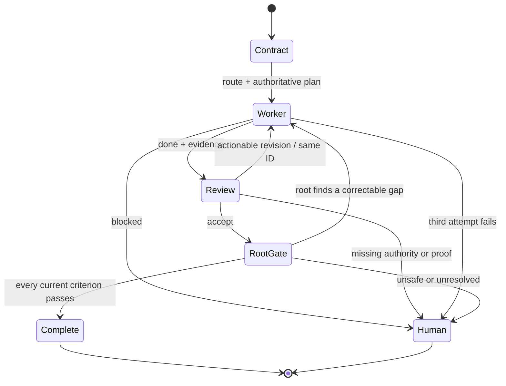

# Architecture

CMRO has two layers: deterministic local distribution tooling and a best-effort native Codex workflow.

## Distribution layer

`routerctl.py` manages an exact payload under `router/`.

1. `MANIFEST.json` allowlists every payload file and records its SHA-256 hash.
2. `install` validates the source, target Git root, path components, conflicts, config, and marked instructions before staging writes.
3. Writes are committed as a batch with backups and rollback on failure.
4. An installation record tracks which files were created rather than merely found.
5. `verify` checks current hashes and structural activation.
6. `uninstall` removes only unchanged, installer-owned content.

This layer is deterministic and locally testable. It does not execute Codex or claim that the agent workflow ran.

## Codex layer

The installed profile uses documented Codex surfaces:

- `.codex/config.toml` sets thread and nesting controls;
- `.codex/agents/*.toml` defines narrow worker and reviewer roles;
- `.agents/skills/route-codex-work/` defines the reusable lifecycle and packet protocol;
- `AGENTS.md` adds durable repository guardrails for explicitly routed runs.

OpenAI documents [custom agents and subagent controls](https://developers.openai.com/codex/subagents), [skills](https://developers.openai.com/codex/skills), [`AGENTS.md`](https://developers.openai.com/codex/guides/agents-md), and the [configuration reference](https://developers.openai.com/codex/config-reference). These primitives support the actors and instructions; they do not promise application-level transition enforcement.

## Lifecycle

## State ownership

The root thread owns:

- the stable run ID and current plan version;
- requirement-to-criterion mappings;
- baseline and allowed paths;
- selected routes and retained agent IDs;
- attempt count and terminal status.

That state stays in the root context unless the user explicitly requests an audit artifact. This avoids polluting application repositories with orchestration files and prevents a worker from rewriting the coordinator’s source of truth.

## Thread topology

`max_depth = 1` allows the root to spawn direct children while preventing workers and reviewers from recursively fanning out. `max_threads = 4` leaves capacity for the root-owned workflow while discouraging broad parallelism. Exactly one child is write-capable for a run. The reviewer is a separate child and is instructed to remain read-only.

Read-heavy discovery can be parallel when it is independent, but the routed implementation and review lifecycle serializes writes. This follows OpenAI’s guidance to be cautious with parallel write-heavy subagent workflows because they increase conflicts and coordination cost.

## Versioned packets

Handoffs use four schemas documented in the installed protocol reference:

- `cmro.plan.v1`
- `cmro.worker.v1`
- `cmro.review.v1`
- `cmro.final.v1`

The schemas make stale context and unsupported completion claims visible. They are conventions checked by the agents, not code-enforced schemas in native Codex.
