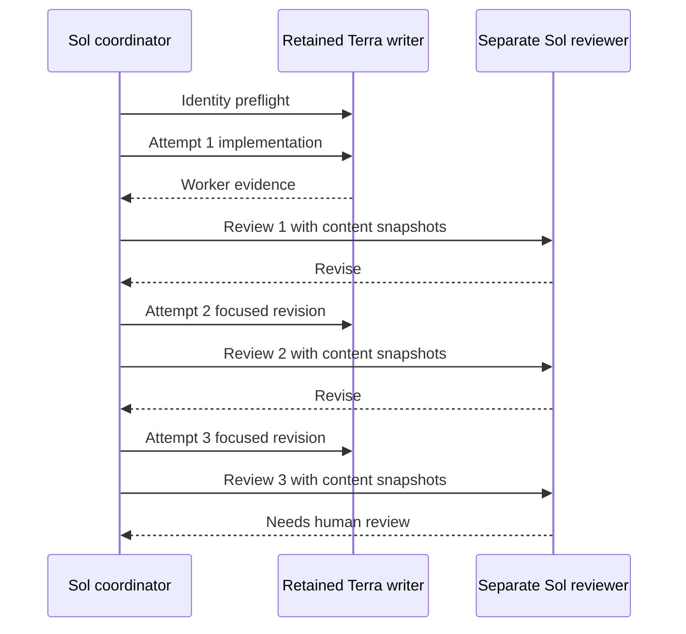

# Fieldstead pilot: a routed run that failed honestly

Date: 2026-07-14  
CMRO version under test: 3.0.0  
Terminal routed status: `needs_human_review`  
Follow-up result: defects fixed outside the bounded run; 21 deterministic tests passed

## What we built

Fieldstead is a local-first browser app for early off-grid container-home planning. It covers project and parcel assumptions, container-envelope questions, electrical loads, solar and battery estimates, water reserves, resilience equipment, and six local-law research tracks. The app has no runtime dependencies, account, telemetry, remote API, or CDN.

The project was deliberately broad enough to exercise real orchestration rather than a toy text edit. Its acceptance criteria included strict import validation, durable local persistence, visible calculation formulas, responsive and keyboard-friendly UI behavior, local-law records, safety disclaimers, and deterministic checks.

## Routed topology

The coordinator ran as configured Sol/xhigh. The writer task was explicitly pinned to Terra/high, and the independent reviewer task was pinned to Sol/xhigh. The same writer and reviewer task IDs were retained across revisions. Every preflight, action, and review turn used exact-turn local session observation; all three root-owned review snapshot pairs matched.

## What the reviewer caught

The third review left two unresolved findings:

1. **High - recovery could overwrite unreadable durable data.** When the initial storage read, parse, or schema check failed, the app displayed defaults. A later ordinary edit could save those defaults over the unreadable value.
2. **Medium - deferred rendering could steal focus.** The app captured the field that emitted `change`, then restored it after a timer. If the user had already moved to the next control, the rerender pulled focus backward.

The three-attempt cap was exhausted, so CMRO returned `needs_human_review`. That is the intended fail-closed result: routing evidence remained valid, while product acceptance did not.

## Outer hardening pass

After the bounded pilot ended, the root implemented a normal hardening pass; a separate read-only auditor then reviewed the result:

- added typed recovery states for read, parse, and schema failures;
- preserved the exact unreadable value, including an empty string;
- blocked ordinary writes during recovery;
- allowed replacement only after an explicit confirmed import or reset;
- added retry and original-value download controls;
- guarded access when the browser's `localStorage` property itself throws;
- captured focus at deferred-render execution time and restored text selection direction;
- cleared stale import previews and file inputs across lifecycle transitions; and
- contained wide energy tables without document-level mobile overflow.

The final app passed 21 deterministic Node tests, JavaScript syntax checks, whitespace checks, source scans for unsafe HTML/network behavior, and interactive desktop/mobile browser QA. An independent read-only audit found no remaining blocker.

## What the router itself learned

The first useful worker response did not conform to the `cmro.worker.v3` packet shape. A same-task, no-write normalization follow-up produced a valid packet, but v3.0.0's final validator inferred attempts from every observed post-preflight turn. That made a representation-only repair look like another implementation attempt.

CMRO v3.0.1 addresses the issue with two controls:

- `validate_packet.py` checks raw worker/reviewer JSON against root-owned run, plan, actor, route/model, attempt, acceptance, and path context before handoff.
- Final records distinguish `action_turn_ids` from `packet_repair_turn_ids`; `packet_repairs` must bind a single `format-only`, `writes: false` follow-up to an observed action and include matching before/after content digests.

This preserves the exact runtime evidence while ensuring that only substantive implementation turns consume the three-attempt budget.

## What this does and does not show

This pilot shows that CMRO can pin and retain a Sol -> Terra -> Sol task topology in one saved local project, detect real defects through independent review, feed actionable findings back to the same writer, preserve reviewer-time artifact snapshots, and stop without claiming completion when its attempt budget is exhausted.

It does not prove that Terra is better or cheaper than another model, that every Codex client exposes the same control plane, that local session metadata is cryptographic attestation, or that a routed workflow guarantees quality. It is one observed run and should be reproduced before drawing broader performance conclusions.

## Reproduction guidance

Use a committed disposable repository, install CMRO from a verified release, add the target as its own saved Codex project, and invoke `$route-codex-work` explicitly. Preserve the sanitized final record, packet-validator output, exact commands, and independent snapshots. Do not publish raw session logs or task metadata that may contain private prompts or local paths.
